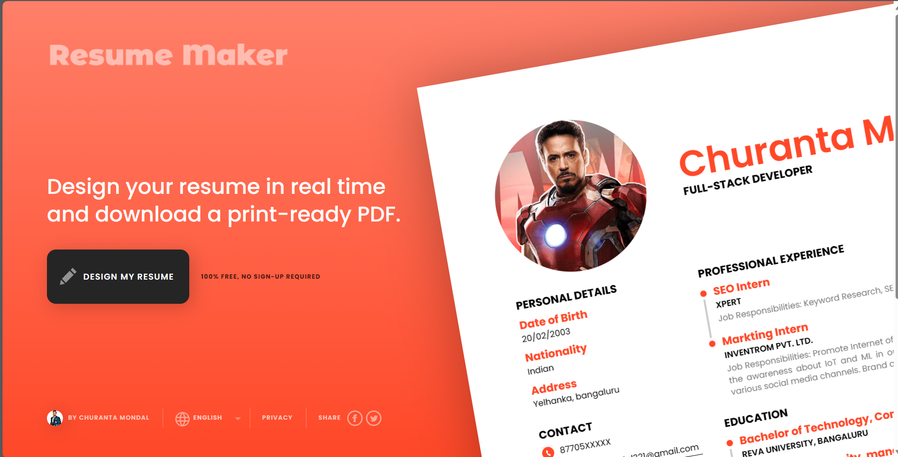
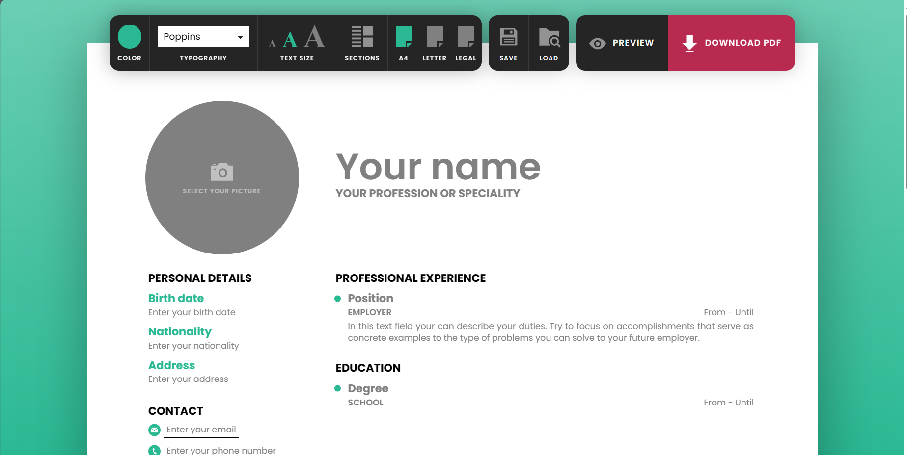

# Resume Maker

Design your resume for free, no sign-up required.

## Overview

Welcome to Resume Maker, a free online resume builder that allows you to create and design your resume in real-time. No sign-up is required, and you can download a print-ready PDF once you are satisfied with your resume.

## Features

- **User-friendly Interface:** Our platform provides a simple and intuitive interface, making it easy for you to create your professional resume.

- **Real-time Editing:** Make changes to your resume in real-time, and preview the results instantly.

- **Download PDF:** Once your resume is ready, you can download a print-ready PDF for your job application.

## Usage

1. Open `index.html` in your web browser.

2. Design your resume by editing the content in the provided sections.

3. Customize the color scheme, typography, and text size using the menu on the left.

4. Use the "Sections" menu to toggle various sections of your resume on or off.

5. Choose your preferred paper size (A4, Letter, or Legal) using the menu on the left.

6. Save your progress or load a previously saved resume using the corresponding buttons.

7. Preview your resume before downloading the final PDF.

## Customization

### Color Scheme

- The color scheme of your resume can be customized using the "COLOR" menu. Choose from predefined color options or select a custom color.

### Typography

- Customize the typography of your resume using the "TYPOGRAPHY" menu. Choose from various font options.

### Text Size

- Adjust the text size of your resume with the "TEXT SIZE" menu. Choose from small, medium, or large text sizes.

### Sections

- Use the "SECTIONS" menu to toggle various sections of your resume on or off, depending on your preferences.

### Paper Size

- Choose your preferred paper size (A4, Letter, or Legal) using the menu on the left.

## Additional Information

- Author: Churanta Mondal

## Social Media

- Follow me on Linkedin: [https://www.linkedin.com/in/churanta/]

## Issues and Contributions

If you encounter any issues or have suggestions for improvement, please [open an issue](https://github.com/Churanta123/Resume-Maker/issues). Contributions are welcome!

## License

This project is licensed under the [MIT License](LICENSE).

---

Feel free to explore Resume Maker, and we hope it helps you create a standout resume for your job applications!# Coding-Raja-Technologies-Internship--Task-1
# Coding-Raja-Technologies-Internship--Task-1
# Coding-Raja-Technologies-Internship--Task-1
